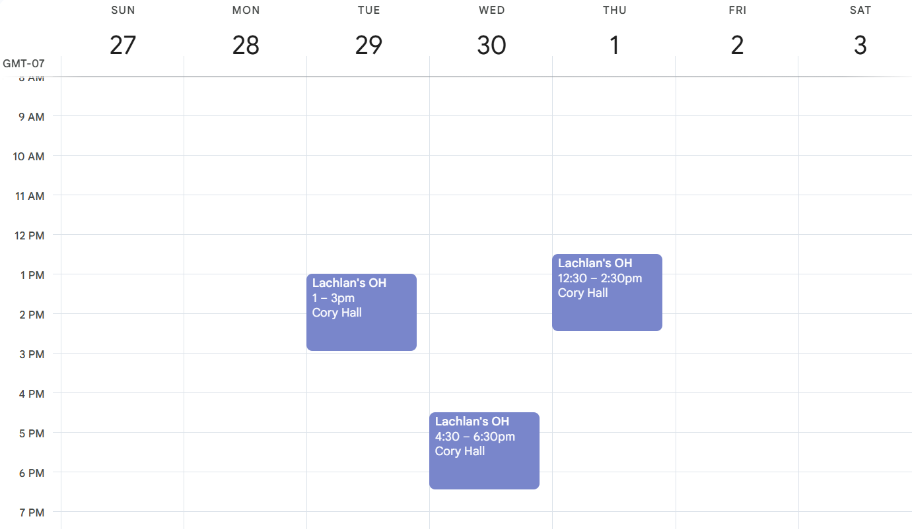

# Section 1: Introduction

Welcome to the Bike Builders of Berkeley Electrical subteam! To ensure everybody starts off on the same page, we ask that you complete this training.

For this training, you are going to design a PCB that can create PWM waves (don't worry if you don't know what this is yet!). This lab has a major emphasis on PCB layout, so although the schematic (circuit drawing) will be given to you, you will be designing your own layout.

### Here is a general overview of the training:
- [Section 2](./Section2.md) is an overview of basic electrical concepts you will learn in classes EECS 16A/B. If you have already taken those classes, feel free to look over the document as a refresher.
- [Section 3](./Section3.md) introduces KiCad, which is the software we use to design schematics and PCBs. This section focuses on the schematic portion of KiCad.
- [Section 4](./Section4.md) goes over the key concepts behind the e-bike motor driver, such as PWM, MOSFETs, and 555 timers.
- [Section 5](./Section5.md) goes over the PCB layout portion of KiCad.
- [Section 6](./Section6.md) introduces G-code and has you write a program that generates it.

## Deadline for returning AND new members (Saturday, Feb 8th at 6:00pm)
This is the last in-person office hours session for the Section 6 check-off. However, based on demand and lab staff availability, we will try to extend the deadline to Sunday.

# OFFICE HOUR TIMES
In-person office hours for help and checkoffs.
## All office hours will be held in Cory 246 (SuperNode)
- If you cannot enter the building, call the office hour staff (numbers are on Slack profiles).

